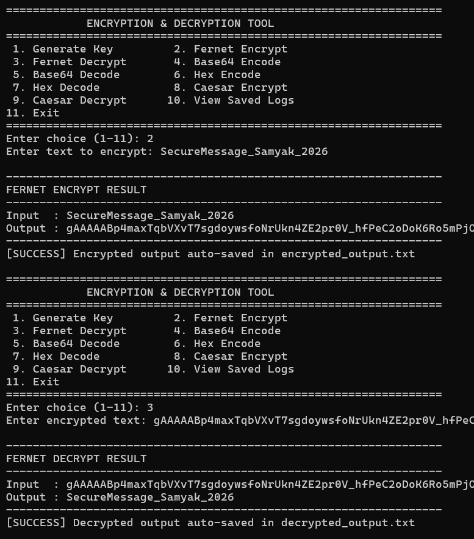
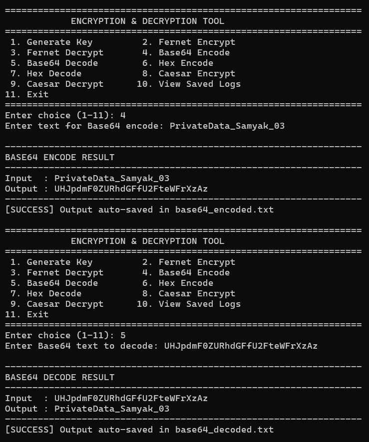
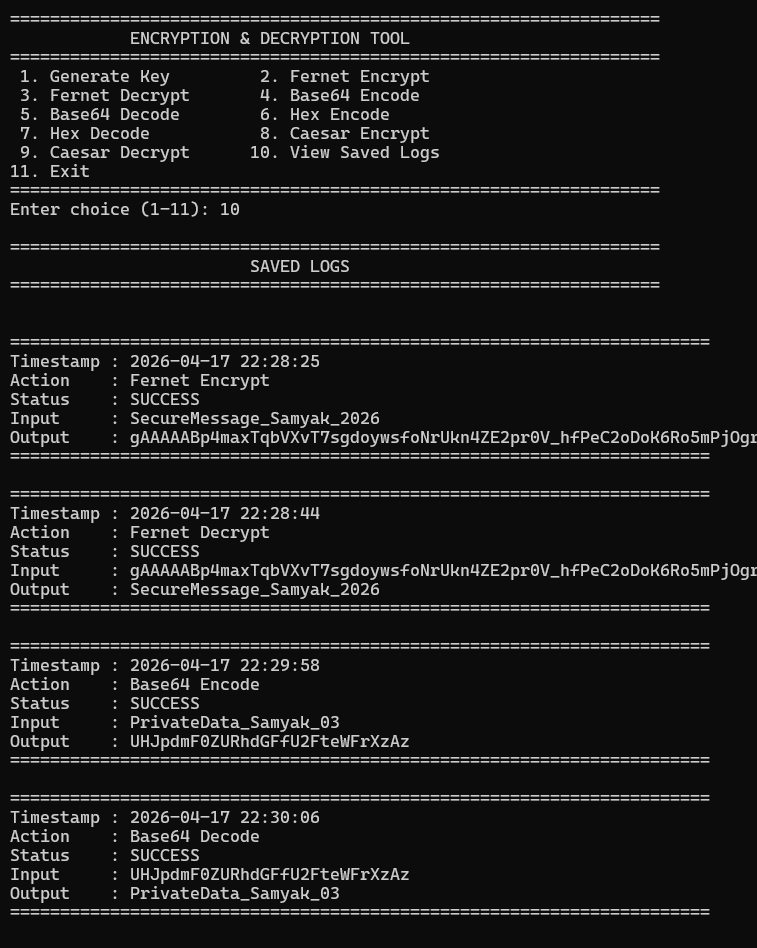

# 🔐 Encryption & Decryption Tool

## 📖 Description
This is a Python-based command-line tool to securely encrypt and decrypt text using a secret key.  
It also supports Base64, Hex, and Caesar cipher techniques.

This project was developed as part of a cybersecurity internship project.

---

## 🚀 Features
- Secure Text Encryption & Decryption  
- Base64 Encode & Decode  
- Hex Encode & Decode  
- Caesar Cipher (Encrypt & Decrypt)  
- Automatic Output Saving  
- Timestamp-Based Logging System  
- View Saved Logs Functionality  

---

## 🛠️ Technologies Used
- Python  
- Cryptography Library (Fernet)  

---

## ▶️ How to Run

1. Install dependency  
pip install cryptography  

2. Run program  
python main.py  

---

## 🧪 Example Usage

Input: SecureMessage_Samyak_2026  
Encrypted: gAAAAAB...  
Decrypted: SecureMessage_Samyak_2026  

---

## 📁 Project Structure

Encryption_Decryption_Tool/
- main.py  
- secret.key  
- encrypted_output.txt  
- decrypted_output.txt  
- base64_encoded.txt  
- base64_decoded.txt  
- logs.txt  
- README.md  
- Encryption_Decryption_Report.pdf  
- screenshots/  

---

## 📸 Screenshots

### 🔹 Encryption & Decryption

### 🔹 Base64 Encode & Decode

### 🔹 Logs with Timestamp

---

## 📌 Applications
- Secure storage of text data  
- Learning cryptography basics  
- Cybersecurity practice  

---

## ⚠️ Disclaimer
This project is for educational purposes only.

---

## 👨‍💻 Author
Samyak Bhaisare
